# Day 1 Collaborative Document

Welcome to the collaborative document for the 2023-05-09-ds-cr-tusail workshop.


## 🎓 Certificate of attendance

If you attend the full workshop you can request a certificate of attendance by emailing to training@esciencecenter.nl .

## ⚖️ License

All content is publicly available under the Creative Commons Attribution License: [creativecommons.org/licenses/by/4.0/](https://creativecommons.org/licenses/by/4.0/).

## 🙋Getting help

To ask a question, raise your hand in zoom. Click on the icon labeled "Reactions" in the toolbar on the bottom center of your screen,
then click the button 'Raise Hand ✋'. For urgent questions, just unmute and speak up!

You can also ask questions or type 'I need help' in the chat window and helpers will try to help you.
Please note it is not necessary to monitor the chat - the helpers will make sure that relevant questions are addressed in a plenary way.
(By the way, off-topic questions will still be answered in the chat).


## 🖥 Workshop website

💻 [Workshop website](https://esciencecenter-digital-skills.github.io/2023-05-09-ds-cr-tusail/)

🛠 [Setup instructions](https://esciencecenter-digital-skills.github.io/2023-05-09-ds-cr-tusail/#setup)

## 👩‍🏫👩‍💻🎓 Instructors

Barbara Vreede, Ole Mussmann

## 🧑‍🙋 Helpers

Luisa Orozco, Maurice de Kleijn


## 🗓️
Agenda
| Time | Topic | status |
|--:|:---|--|
| 9:00 | 	Welcome and icebreaker |:heavy_check_mark:
| 9:15 | Good Practices in Research Software Development | :heavy_check_mark:
| 10:15 | Coffee break |:coffee:
| 10:30 | Introduction to version control with Git | :heavy_check_mark:
| 11:30 | Coffee break |:coffee:
| 11:45 | Introduction to version control with Git |:heavy_check_mark:
| 12:45 | Wrap-up |:heavy_check_mark:
| 13:00 | END |:fire:

## 🔧 Exercises & Quizes

:dart: **QUIZ**

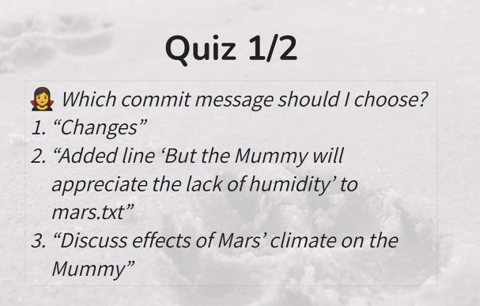


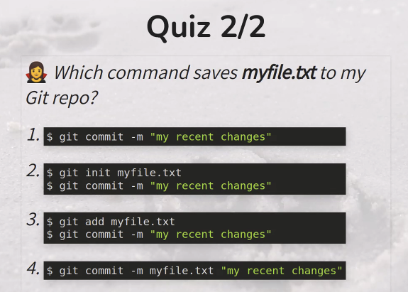

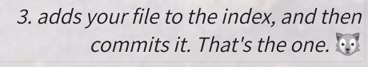

**Exercise 1**

1. Edit mars.txt noting your decision to consider Venus as a base
1. Create a file venus.txt with your thoughts about Venus as a base for you and your friends
1. Add changes from both files to the staging area, and commit those changes.

**Solution exercise 1**
```bash=
code mars.txt
cat mars.txt

Maybe I should start with a base on Venus.

code venus.txt
cat venus.txt

Venus is a nice planet and I definitely should consider it as a base.

git add mars.txt venus.txt

# Or with multiple commands:
# git add mars.txt
# git add venus.txt

git commit -m "Write plans to start a base on Venus"

[main cc127c2]
 Write plans to start a base on Venus
 2 files changed, 2 insertions(+)
 create mode 100644 venus.txt
```

:dart: **QUIZ**
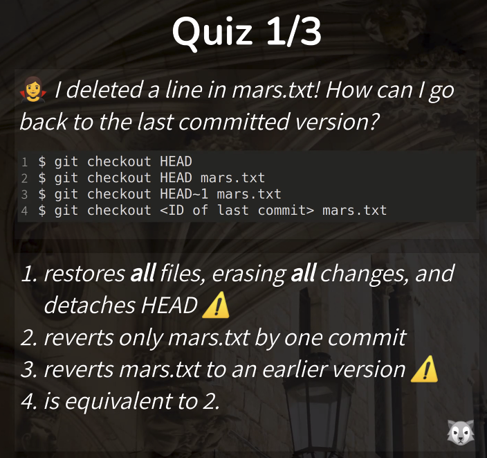


```bash
# Find the commit ID where you want to revert to.
$ git show HEAD
# Copy the first 7 characters of that ID, e.g. 825524b
$ git revert [commit ID]
# Type commit message
# Save and close editor
```
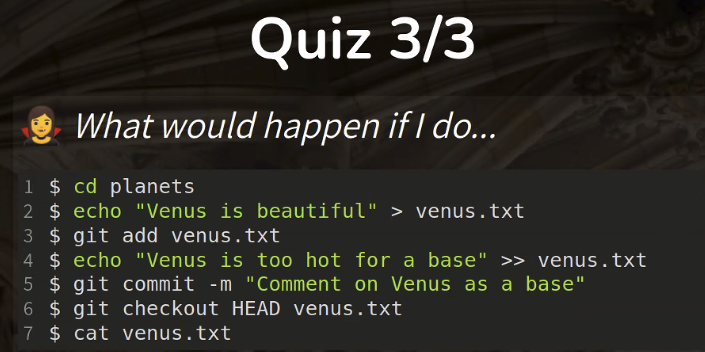

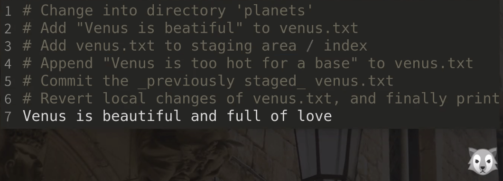


Answer: `Venus is Beautiful`
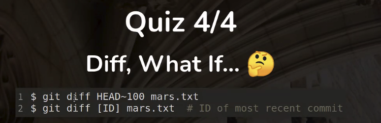

Answer: `Nothing happens`


## 🧠 Collaborative Notes

### Intro to Good practices

**How to write good code?**
- Programming is writing any type of code.
- Software Engineering is programming integrated over time.

**Development speed**

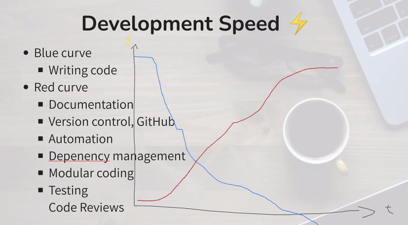

Blue - writing code
Red - Documentation, Version control, Automation, Dependency management, Modular coding, Testing, Code Reviews

| Scenario | Scenario Use                             | no. users      | use |
| -------- | ------------------------------- | -------------- | --- |
| 1shot    | none                            | 1              |   push to main  |
| week+    | Git & Github                    | 2+             |    Branches, merging |
| 3months+ | Testing                         | 2+ (+students)  |  code review   |
| 6months+ | Documentation, automate testing | 2+ (+external) |    release branch |

#### Open Git Bash
Check that git is working in your computer:
```bash
ssh git@github.com
```

```bash
git --version
```
### Git

What is version control?
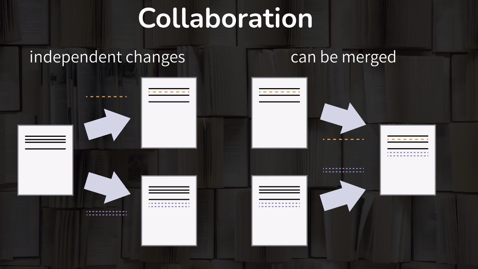

**Git commands**

```
git config --global user.name "Vlad Dracula"
git config --global user.email "vlad@tran.sylvan.ia"
```

Check what the configuration on your system is with:
```
git config --list
```
Recommended settings: ensure the main branch of a new repository is always called `main`:

```
git config --global init.defaultBranch main
```


Make sure that line endings are not going to introduce "changes":

On Mac/Linux:
```
git config --global core.autocrlf input
```
On windows:
```
git config --global core.autocrlf true

```

Set the default editor to VS Code (optional):
```
git config --global core.editor "code --wait"

```

#### VIM
VIM is a bit tricky to use. Many memes have been made about it...

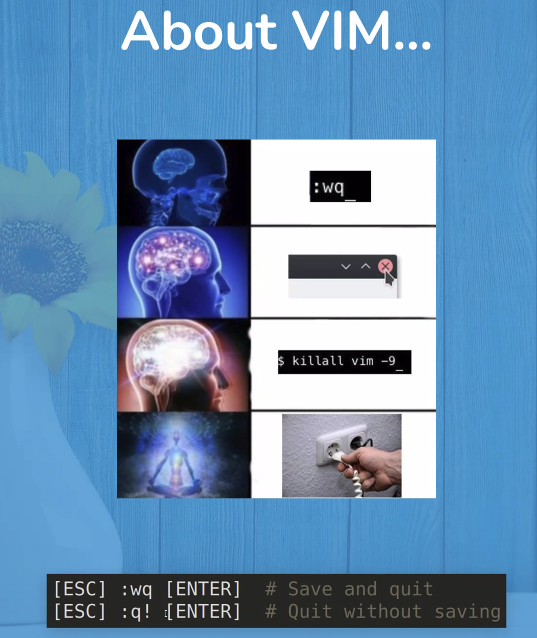

Exiting VIM:
[esc] :wq [enter]
OR:
[esc] :q! [enter]


All git commands
```
git help
```

Short help on config
```
git config -h
```

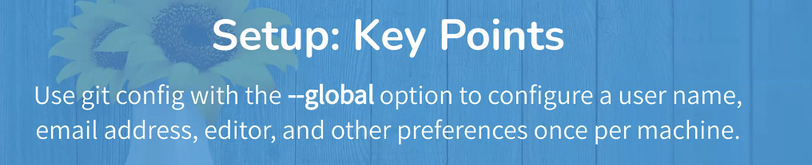


### Creating a Repository

*Where does Git store information?*

Case: > *Wolfman and dracula investigate sending a planetary lander to Mars..*

Change a working directory
```
cd ~/Desktop
mkdir planets
cd planets
git init
```

List all files in the directory (-a to view hidden files as well)
```
ls -a
ls .git
```

Create out first branch
```
git checkout -b main
```

to see all branches
```
git branch -v
```

to see the status
```
git status
```

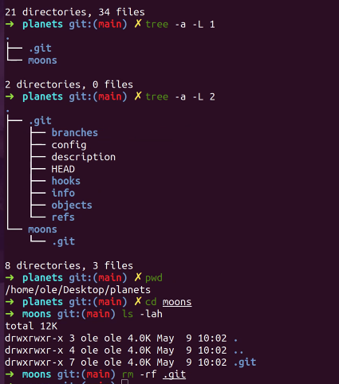


*after break*

### Tracking Changes
*Holy realms of git*
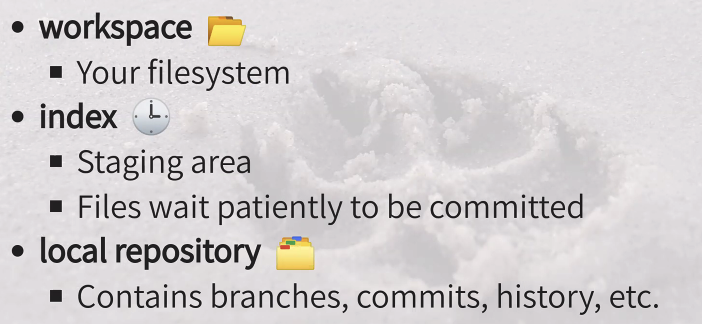

Create some files
Go to ~/Desktop/planets
```
cd ..
```

This command will open `mars.txt` in VS code

```
code mars.txt
```
Write a line in your file `mars.txt`
```bash
Cold and dry, but everything is my favorite color
```

In VS Code:
- save : [CTRL]+S
- exit : [CTRL]+Q

```bash
# print file content
cat mars.txt
# check repo status
git status
# add the modified file to stagging area
git add mars.txt
# Commit the changes -m is too add a message
git commit -m "Start notes on Mars as base"
```
To see your log of commits
```bash
git log
# use git log -2 to see the previous 2 commits.
```

Add another line to `mars.txt` (see above)
```bash
# inside mars.txt
The two moons may be a problem for Wolfman
```

```bash
git status
# to see differences in ´mars.txt´ file (between the file on our machine with the file that is on file system)
git diff
```
results in :
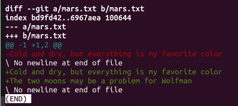

Here we are staging the updated version of `mars.txt`

```bash
git add mars.txt
# commit mars.txt including a description
git commit -m "Adds concerns about effects of Mars´ moons on Wolfman"
```

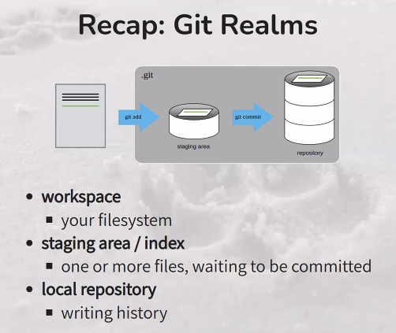

Add another line to `mars.txt` (and commit see above)

```
Cold and dry, but everything is my favorite color
The two moons may be a problem for Wolfman
But the Mummy will appreciate the lack of humidity
```

use diff to compare
```bash
git diff
# no result
git diff --staged
# will see differences
```

commit separetely different parts of a file:
```bash
git add -p mars.txt
```
- `y` stage the chunk
- `n` ignore the chunk
- `s` split it into smaller chunks
- `e` to manually edit the chunk (allowing to remove or edit parts to commit of the file)
- `q` to exit.


To restore changes that were made
```bash
git restore --staged mars.txt
```

Tips: Pager

*To look back what you did*
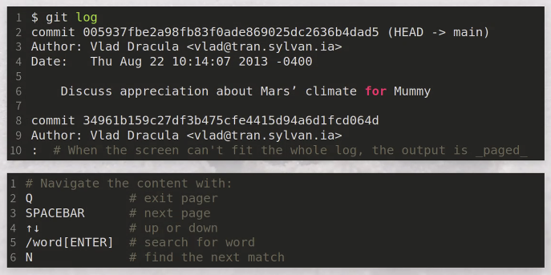

```bash
git diff --color-words
# will specifically highlight what has changed
```
For example:
`But the Mummy will appreciate the lack of humidity`
Changed to:
`But the Mummy will probably appreciate the lack of humidity`

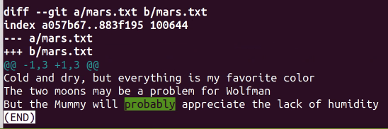

To restore the changes (discards local changes and rolls back the file to the status that it is in the repository)
```bash
git restore mars.txt
```
If you have moved the file to the staging area: `git add mars.txt` you can restore the changes as:
```bash
git restore --staged mars.txt
```

#### Directories
We are going to add a directory ´spaceships´
```bash
mkdir spaceships
```

When adding a empty folder git does nothing. There needs to be a file in it. Therefore, `git add spaceships` will do nothing.

Add a file (for example apollo-11.txt) to folder spaceships.
```bash
add spaceships/apollo-11
# add file
commit spaceships/apollo-11
# commit the file
```

**make sure to have an updated version of Git**

Wrap-up

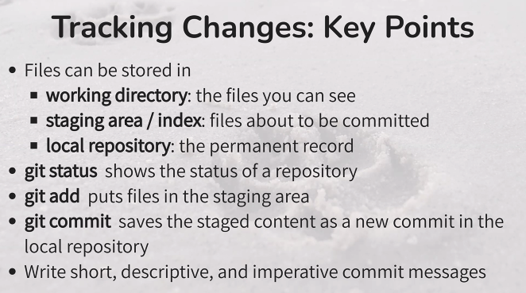

### Explore History

Looking back in time.

First we are going to add an extra line to the file with an ill considered change.

```
Cold and dry, but everything is my favorite color
The two moons may be a problem for Wolfman
But the Mummy will appreciate the lack of humidity
An ill-considered change
```
Head will look at the last change that was made on your current branch.
```bash
git diff HEAD mars.txt
# look at the difference 1 commit before
git diff HEAD˜1 mars.txt
# can change 1 to n: look at any point back in history
```
You can check the changes compared to a specific commit. Each commit has its hash (unique).
```bash
git log
# to identify the commit hash
```
for example #sdfjb232dsfjsdfh213214231
```bash
git diff sdfjb232dsfjsdfh213214231 mars.txt
```
:bulb: You don't need to pass the complete hash, just the first few characters will suffice.

```bash
git checkout HEAD mars.txt
```

*Wrap-up on the Git workflow*

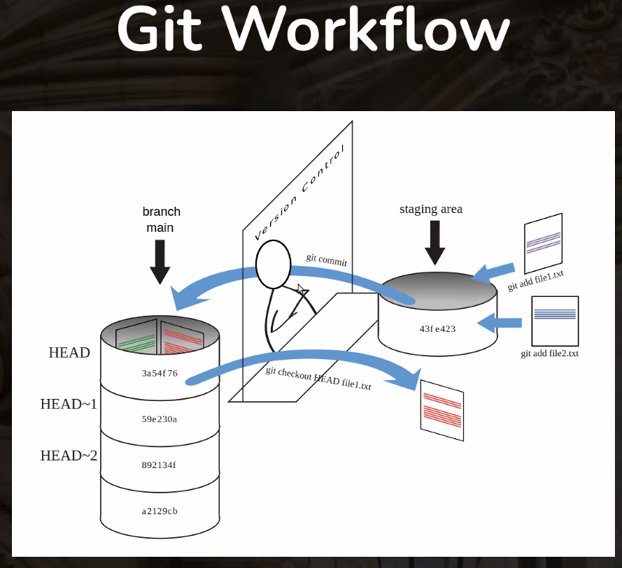

*Detached HEAD state:* We can look at a given version, but we cannot commit to the last step of the history.

```bash
git checkout --detach 12345AA
# to look at the status of the repo at certain commit (point in time)
```

**Create a new branch**

```bash
git checkout -b "demo_branch"
```
Branches are alternate realities that can exist seperately from your reality ~ *Ole*

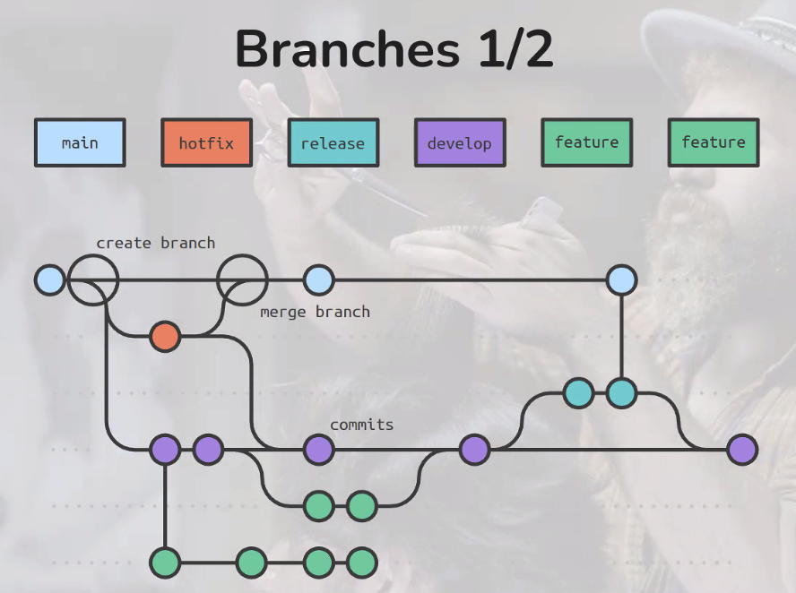

```bash
git branch -v
#to see on which branch you are
```

```bash
git merge demo_branch
#To merge the demo_brach (you created above with the main branch)
```

***Let Git help you***
Git tells you how to proceed
```bash
git status
#read what Git tells you
```


## 📚 Resources
:exclamation: [other Netherlands eScience trainings](https://www.esciencecenter.nl/digital-skills/)

:pencil2: [config git to open files with your editor](https://git-scm.com/book/en/v2/Appendix-C:-Git-Commands-Setup-and-Config#ch_core_editor)

:orange_book: [Slides](https://ole.mn/2023-05-09-tusail/git/)