# Day 2 Collaborative Document

Welcome to the collaborative document for the 2023-05-09-ds-cr-tusail workshop.
This document is synchronized as you type, so that everyone viewing this document sees the same text.

## 🎓 Certificate of attendance

If you attend the full workshop you can request a certificate of attendance by emailing to training@esciencecenter.nl .

## ⚖️ License

All content is publicly available under the Creative Commons Attribution License: [creativecommons.org/licenses/by/4.0/](https://creativecommons.org/licenses/by/4.0/).

## 🙋Getting help

To ask a question, raise your hand in zoom. Click on the icon labeled "Reactions" in the toolbar on the bottom center of your screen,
then click the button 'Raise Hand ✋'. For urgent questions, just unmute and speak up!

You can also ask questions or type 'I need help' in the chat window and helpers will try to help you.
Please note it is not necessary to monitor the chat - the helpers will make sure that relevant questions are addressed in a plenary way.
(By the way, off-topic questions will still be answered in the chat).


## 🖥 Workshop website

💻 [Workshop website](https://esciencecenter-digital-skills.github.io/2023-05-09-ds-cr-tusail/)

🛠 [Setup instructions](https://esciencecenter-digital-skills.github.io/2023-05-09-ds-cr-tusail/#setup)

## 👩‍🏫👩‍💻🎓 Instructors

Barbara Vreede, Ole Mussmann

## 🧑‍🙋 Helpers

Luisa Orozco, Maurice de Kleijn


## 🗓️ Agenda
|  Time | Topic                             |Status|
| -----:|:--------------------------------- | --- |
|  9:00 | Welcome and icebreaker            |:heavy_check_mark: |
|  9:15 | Workshop Introduction             |   :heavy_check_mark: |
|  9:30 | Collaboration with Git and GitLab |   :heavy_check_mark:  |
| 10:15 | Coffee break                      |   :coffee:  |
| 10:30 | Collaboration with Git and GitLab |    :heavy_check_mark:  |
| 11:30 | Coffee break                      |  :coffee:   |
| 11:45 | Collaboration with Git and GitLab |:heavy_check_mark:    |
| 12:45 | Wrap-up                           |  :heavy_check_mark:   |
| 13:00 | END                               | :heavy_check_mark:    |

## 🔧 Exercises

### Excercise 1
IGNORE THE FOLLOWING FILES:
- anything in the data folder
- any file that ends in .doc

Answer:
```
data/   # the data folder in its entirety
data/*  # items inside the data folder - this allows the option to explicitly add a file with !data/addthisdata.csv
*.doc
```

### Exercise 2: create a remote repository

- Create a repository
- Name it
- Do NOT add a Readme, License, or any other documents!
- Use the instructions on GitHub to connect your local repository to this remote repository on GitHub
- Paste the link to your final repository below.


### Exercise 3: Working as a project collaborator (in breakout rooms)

Do this exercise in pairs; make sure you have worked both as person A and as person B.

#### Part 1
- PERSON A: Create an issue in their repository
- PERSON B: Clone this repository to their system
- PERSON B: Create a new branch (`git checkout -b name_branch`)
- PERSON B: Make the changes requested in the issue
- PERSON B: Push the changes to the remote repository on GitHub
- PERSON B: submit a Pull Request, refer to the issue (e.g. "Closes #1")

#### Part 2
- PERSON A: review the Pull Request
- PERSON B: address the comments
- PERSON A: approve the Pull Request
- PERSON B: merge the Pull Request

### Homework - Before the 16th of May

Make a Pull Request on a repository **where you do not have collaborator access**.

- Make a fork of the repository to your own GitHub account
- Make edits in this fork
- Make a Pull Request from the forked repository to the original

Be sure to use issues as you did before! You can initialize an issue yourself in a repository from one of your colleagues, and then address this issue in your pull request.


## 🧠 Collaborative Notes

**Requirements:**
 - Github account
 - member of tusail organization

Start with a new repository.

Advice to have a sandbox folder. Make a folder in Tusail folder.

``` bash
mkdir temperature_conversions
cd temperature_conversions
```

```bash
git init
# to check where you are.
git status
```
Create a python script enter VS code typing `code` (or use the editor of your choice). Create a file `conversion.py`

```python
def celsius_to_kelvin(celsius):
    return celsius + 273.15
```
Add the file that you just created to your repository:
```bash
git add conversion.py
git commit -m "first function"
```

Gitignore
Will tell Git that there are files that it needs to ignore.

```bash
touch .gitignore
git status
```
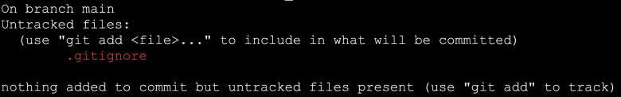

`.gitignore` is the file that git looks for. And based on that it is going to ignore the files in a specific folder.

Listing in `.gitignore` file that you do not want to get track on. E.g. `*.csv` or `*.dat`.

`results/*` is for a folder (not necessary for to have `/` git, but it makes it better readable for us)

:bulb: The * is a wildcard, it means (one or more of) any characters.

#### gitignore syntax:
```
file.txt              # the file "file.txt"
directory/*           # the content of directory "directory"
*.log                 # all files ending with ".log"
error_?.log           # "error_1.log", "error_A.log", ...
error_[a-z].log       # "error_a.log", "error_b.log", ...
!error_important.log  # do _not_ ignore "error_important.log"
**/secret             # _all_ "secret" folders and content, everywhere
/home/user/**/secret  # as above, but only within /home/user/
```

Gitignore is very useful to get track on the files you want to focus at.

Have files that you do want to commit. You can either do this by force (using -f).
```bash
git add -f results/output1.csv
```
Be aware, that this can be confusing collaborators of your repository.

Therefore, it is better to add it to your .gitignore file. This can be done by adding.

`!results/output1.csv`

❓ Is it possible to ignore files based on their size?
You will need to explicitly add it in your `.gitignore` file.

Now we are going to connect to TUSAIL organisation.

Go to
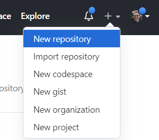

Then:

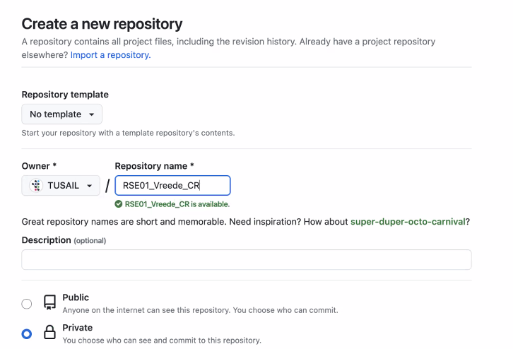

Make sure to select TUSAIL for owner.
Make it *public*

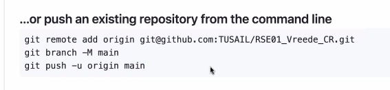

```bash
git remote add origin@github.com:TUSAIL/<name_repo>
git branch -M main
git push -u origin main
```
***Exercise 2 :top:***

Remote repository *Realm*
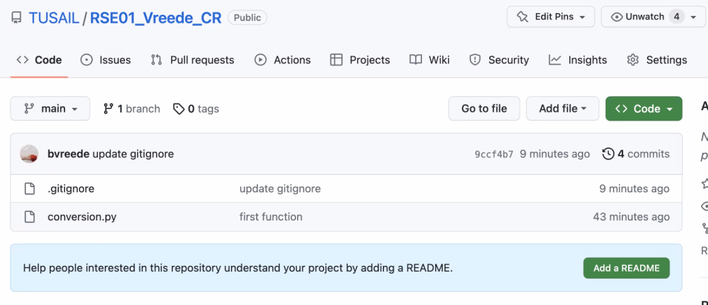

Add some changes to the python script on the remote repository in the web interface. We added a docstring to the only function of `conversion.py`.

```bash
# check the history (in terminal)
git log
```
Add some changes to python script. We added a docstring to the only function of `conversion.py`.
```bash
git add conversion.py
git commit -m "local comment added"
git pull
```
:no_entry_sign: You have divergent branches!
configure your git configuration so that will automatically uses merge and not rebase when pull:
```bash
git config pull.rebase false
```

Solve the conflict :relieved::
You can decide in local file what to do with it.
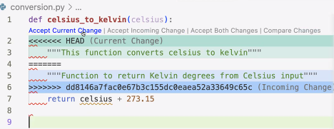

Next you add and commit your fixed file.

```bash=
git add
git commit -m "fix documentation conflict"
git push
```

See on Github the commits that were made (history).
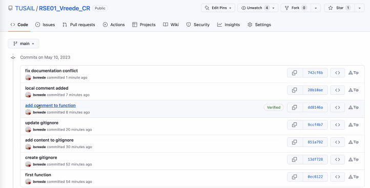

**Wrap-up**
- We made a .gitignore
- We made a conflict and fixed it.

How to add a new .gitignore

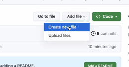

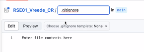

**Choose template**
`python` suggestion are provided by for python scripts. (very useful)

```bash
git pull
#or git fetch, but Ole and Barbara do hardly use it.
git fetch
```

The `.gitignore` file will be stored locally.

**What happens if you first track a file but then you add a path to the .gitignore?**

Create a mock file
```bash
touch mockfile.txt
git add mockfile.txt
git commit mockfile.txt "add file to be removed"
```

Now we want to remove it.

Add it to `.gitignore` file
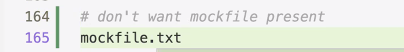

```bash
git status
git add .gitignore
git commit -m "ignore mockfile"
git push
```

To remove the file locally.

```bash
rm mockfile.txt
#or remove the cache
git rm --cached mockfile.txt
git status
git commit -m "do not track mockfile"
# to remove it from the repository and not locally
git push
```

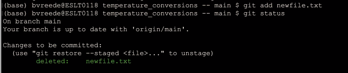

*It is a bit counter intuitive, but you will need to push even deleted files.*

*Git stash*

Make some changes to your python file `conversion.py`:
```python
def celsius_to_kelvin(celsius):
    return celsius + 273.15
def kelvin_to_celsius(kelvin):
    return kelvin - 273.15
```
Then do some changes on the same file in the repository (github): Just a cosmetic change on the documentation

If locally you try to add the python file:
```bash
git add conversion.py
```
:no_entry_sign: Merge conflict `error: your local changes to the follwoing file will be overwritten`

**Stash changes**
Useful if there is a change that you made that you do not want to commit, but there are things that you do want to commit.

*Barbara uses it as an emergency*

```bash
git stash
git pull # pull what happen remotely
git stash pop # pop (your local) changes out again.
```

N.B. The "stash" is the fifth - and final - "holy realm" of git. *Ole´s holy Realms:*
1. local file system
2. index/staging area
3. local repository
4. remote repository
5. stash

#### Collaboration

- Ole is darkmode
- Barbara is ligthmode

Beginning of a collaboration.

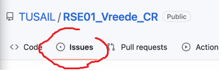

In issues tab of repo discussions take place. e.g. a feature is mising from another user. Issue can be used to solve it, do we want to implement it? Do we want this in our repo etc.?

It is the start of collaborations.

For example:

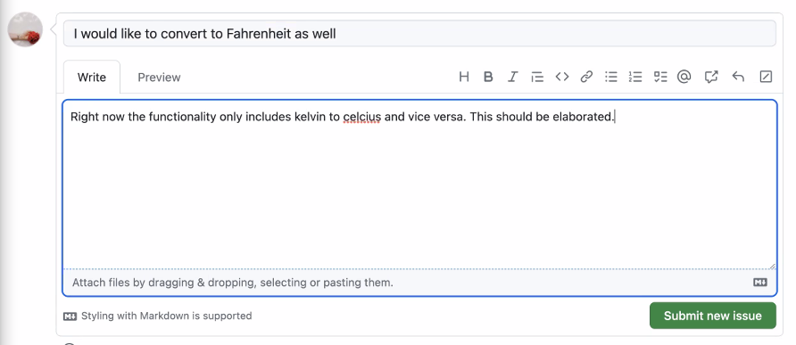

**Submit**

Assigning an person (e.g. Ole)

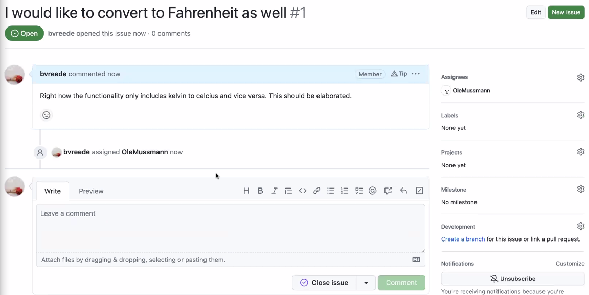

Ole gets a notification in Github

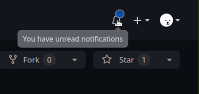

First clone the repo.

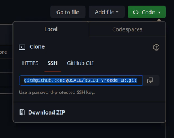

Copy SSH

```bash
clone git@github.com:TUSAIL/RSE01_Vreede_CR.git
```

Before start writing the code. make sure it is assigned to you.

Make a new branch to ensure that you are not intervening with the work of others.

```bash
git checkout -b "1/fahrenheit" #you can decided how to call it. Barbara advices to refer to the issue. Find a convention in your team.
git status # to confirm that you are on the right branch
```

update the python script

```python
def celsius_to_kelvin(celsius):
    return celsius + 273.15
def kelvin_to_celsius(kelvin):
    return kelvin - 273.15
def celsius_to_fahrenheit(celsius):
    return celsius * 9/5 * 30

```

Push the changes:
```bash
git add
git commit -m "add conversion celsius -> fahrenheit"
# or you can create a more elaborated commit message
git commit # will open an editor
git push
git push --set-upstream origin 1/fahrenheit
```
:bulb: If in the body of your commit message you add close #1, then the issue #1 will be closed after the commit on github.

Branches can be seen on github:

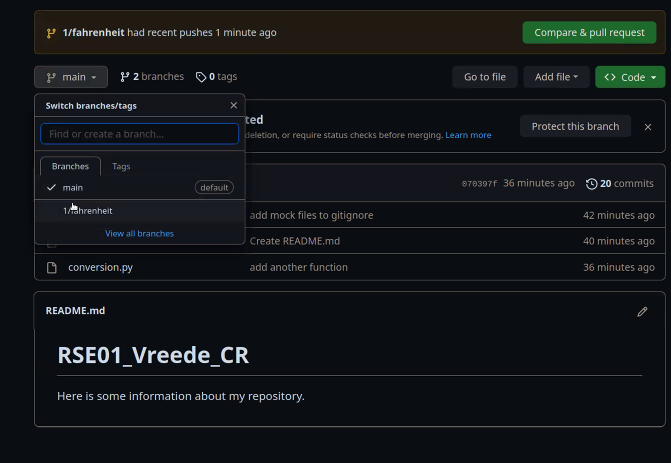


Create a pull requests (PR):
- Go to _Pull requests_ tab
- select base: `main`, compare: `1/fahrenheit` (the branch that you want to merge to main)

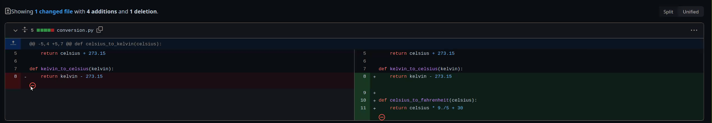

Create pull request:

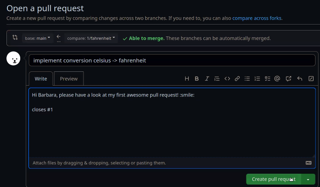


***Exercise 3 :top***

After a pull request review the pull request.
Check that there are no conflicts.

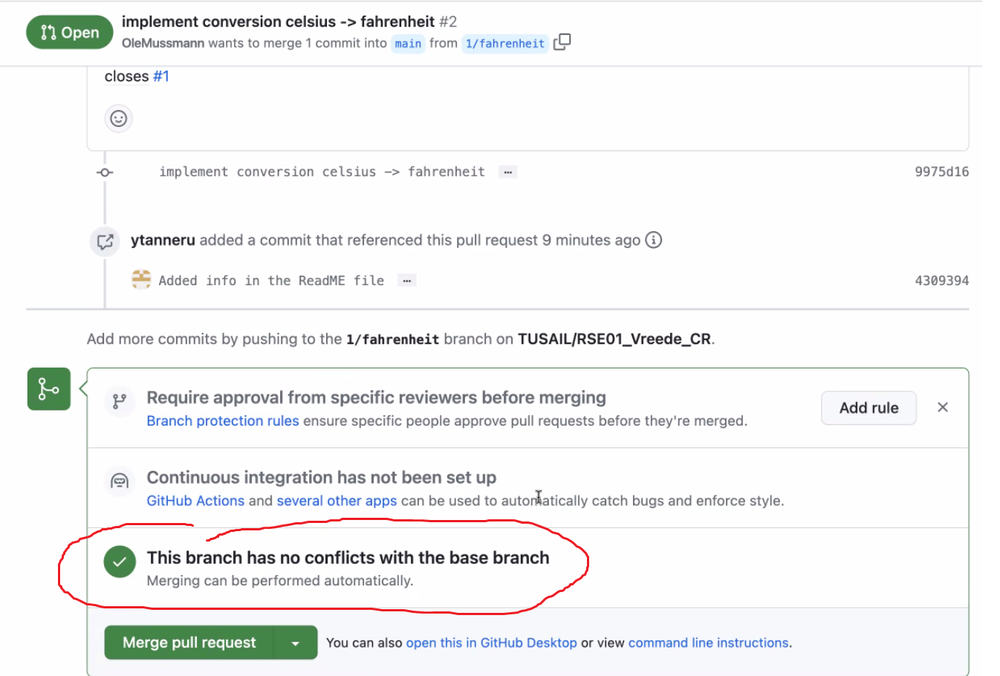


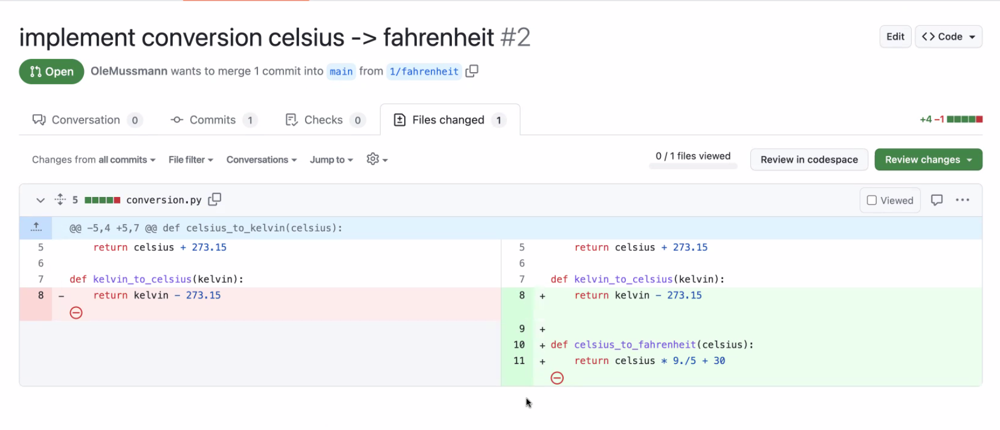

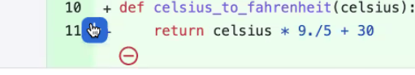

To comment on that specific line in the code:

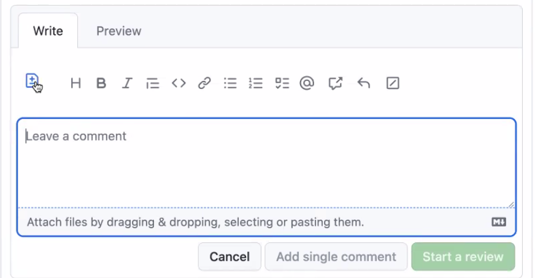

click  to get:

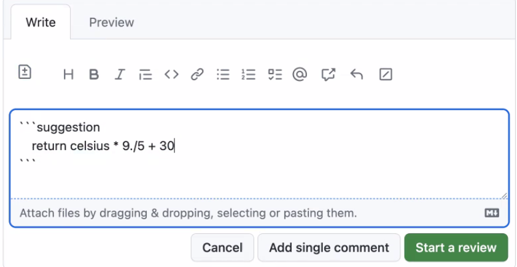

Start a review:
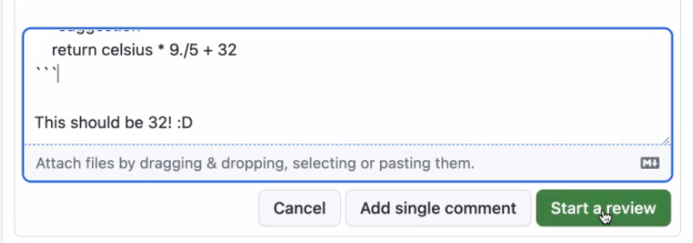

Finish review:
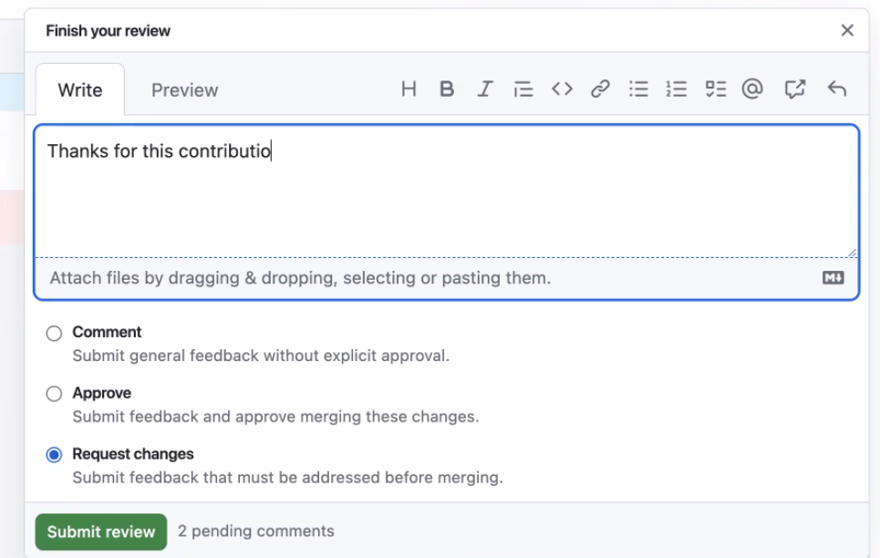


Ole sees:
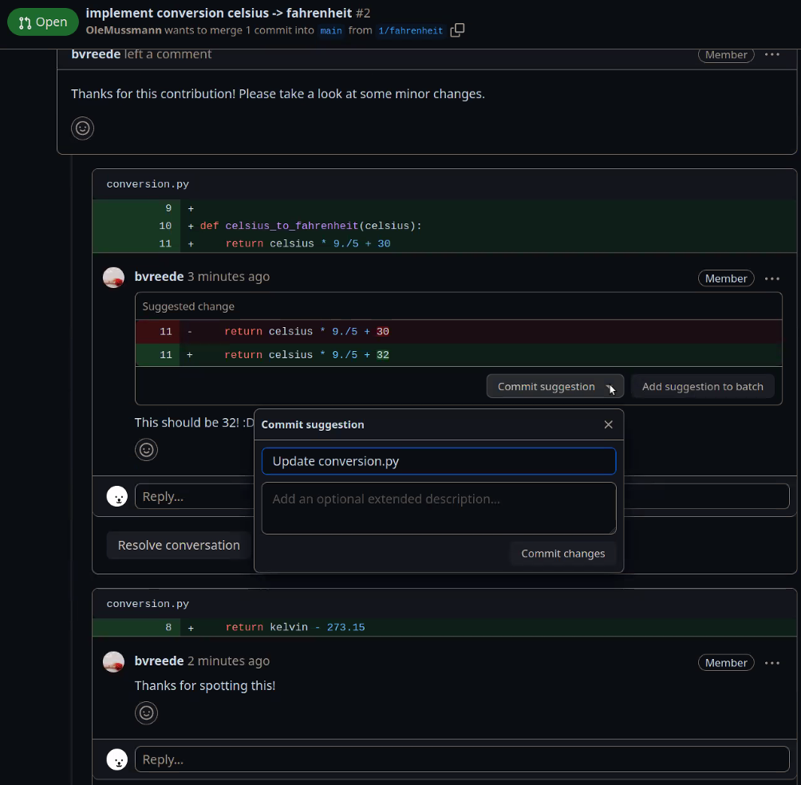

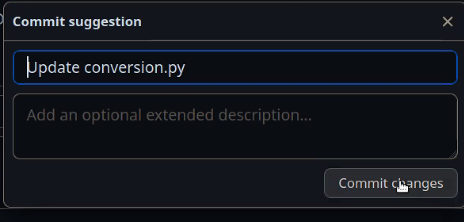
Accepts the updates from Barbara.

Barbara approves the pull request (you can setup your repo in such a way that only approved pull requests are merged with the main)

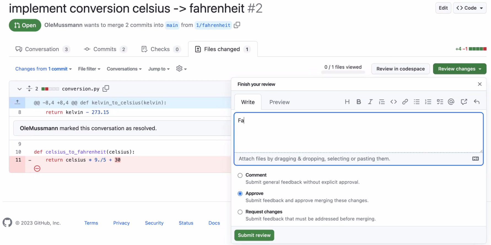

Who should approve it and merge it with the main?
Barbara or Ole?

Not 100% clear, in bigger projects you have contribution guidelines.

This should be stored in:


Barbara wants Ole to approve it.

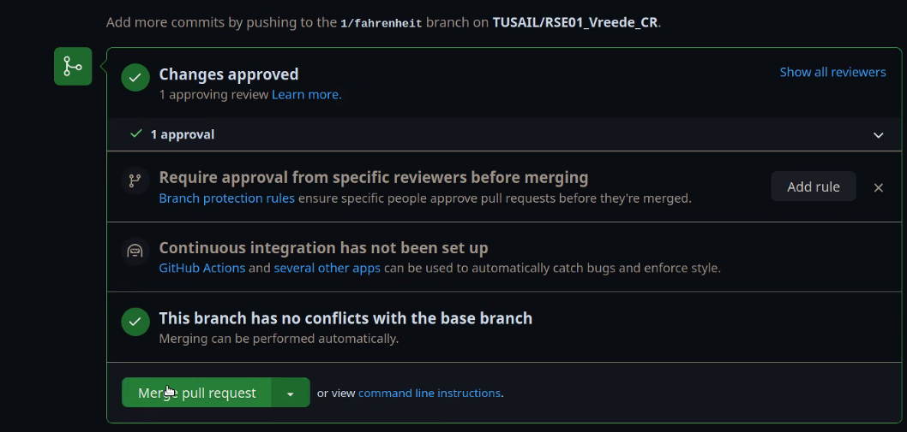

Closes the pull request

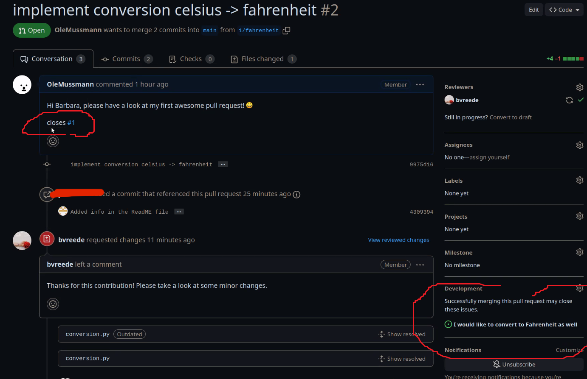

Delete the Branch to avoid a series of branches.


## 📚 Resources

[:bookmark_tabs: Stashing multiple times](https://stackoverflow.com/questions/18063521/git-stash-twice#18063664)

[👨🏽‍🏫 Slides about stash](https://ole.mn/estp2022/slides/practical_git/#/stash')

[:musical_score: Rebase explained with music](https://www.youtube.com/watch?v=S9Do2p4PwtE)

