# Day 3 Collaborative Document

Welcome to the collaborative document for the 2023-05-09-ds-cr-tusail workshop.


## 🎓 Certificate of attendance

If you attend the full workshop you can request a certificate of attendance by emailing to training@esciencecenter.nl .

## ⚖️ License

All content is publicly available under the Creative Commons Attribution License: [creativecommons.org/licenses/by/4.0/](https://creativecommons.org/licenses/by/4.0/).

## 🙋Getting help

To ask a question, raise your hand in zoom. Click on the icon labeled "Reactions" in the toolbar on the bottom center of your screen,
then click the button 'Raise Hand ✋'. For urgent questions, just unmute and speak up!

You can also ask questions or type 'I need help' in the chat window and helpers will try to help you.
Please note it is not necessary to monitor the chat - the helpers will make sure that relevant questions are addressed in a plenary way.
(By the way, off-topic questions will still be answered in the chat).


## 🖥 Workshop website

💻 [Workshop website](https://esciencecenter-digital-skills.github.io/2023-05-09-ds-cr-tusail/)

🛠 [Setup instructions](https://esciencecenter-digital-skills.github.io/2023-05-09-ds-cr-tusail/#setup)

## 👩‍🏫👩‍💻🎓 Instructors

Barbara Vreede, Ole Mussmann

## 🧑‍🙋 Helpers

Luisa Orozco, Maurice de Kleijn

## 🗓️ Agenda
|  Time | Topic                                            |                    |
| -----:|:------------------------------------------------ | ------------------ |
|  9:00 | Welcome and icebreaker and discussing "homework" | :heavy_check_mark: |
|  9:15 | Writing modular code                             | :heavy_check_mark: |
| 10:15 | Coffee break                                     | :heavy_check_mark: |
| 10:30 | Writing modular code                             | :heavy_check_mark: |
| 11:00 | Documentation                                    | :heavy_check_mark: |
| 11:30 | Coffee break                                     | :heavy_check_mark: |
| 11:45 | Documentation                                    | :heavy_check_mark: |
| 12:45 | Wrap-up                                          | :heavy_check_mark: |
| 13:00 | END                                              | :heavy_check_mark: |

## 🔧 Exercises

### Watch this video:
https://youtu.be/CFRhGnuXG-4


### Exercise 1: extract functions from the following (terrible) code.
Some things to keep in mind:
- Keep the functions pure (i.e.: no interaction with their environment)
- Good interfaces (input/output) make them testable
- Try to keep modules similarly sized (not a must, but a good rule-of-thumb)
- Use good naming practices to describe the functionality

```python=
def convert_temperature(temperature, unit):
    if unit == "F":
        # Convert Fahrenheit to Celsius
        celsius = (temperature - 32) * (5 / 9)
        if celsius < -273.15:
            # Invalid temperature, below absolute zero
            return "Invalid temperature"
        else:
            # Convert Celsius to Kelvin
            kelvin = celsius + 273.15
            if kelvin < 0:
                # Invalid temperature, below absolute zero
                if temperature % 2 == 0:
                    return "Invalid temperature"
                else:
                    if kelvin % 2 == 0:
                        return "Invalid temperature"
                    else:
                        return celsius, kelvin
            else:
                if celsius % 2 == 0:
                    # Convert Celsius to Fahrenheit
                    fahrenheit = (celsius * (9 / 5)) + 32
                    if fahrenheit < -459.67:
                        # Invalid temperature, below absolute zero
                        return "Invalid temperature"
                    else:
                        if fahrenheit % 2 == 0:
                            return fahrenheit, kelvin
                        else:
                            return fahrenheit, celsius
                else:
                    return celsius, kelvin
    elif unit == "C":
        # Convert Celsius to Fahrenheit
        fahrenheit = (temperature * (9 / 5)) + 32
        if fahrenheit < -459.67:
            # Invalid temperature, below absolute zero
            return "Invalid temperature"
        else:
            # Convert Celsius to Kelvin
            kelvin = temperature + 273.15
            if kelvin < 0:
                # Invalid temperature, below absolute zero
                if temperature % 2 == 0:
                    return "Invalid temperature"
                else:
                    if kelvin % 2 == 0:
                        return "Invalid temperature"
                    else:
                        return fahrenheit, kelvin
            else:
                if temperature % 2 == 0:
                    # Convert Celsius to Fahrenheit
                    fahrenheit = (temperature * (9 / 5)) + 32
                    if fahrenheit < -459.67:
                        # Invalid temperature, below absolute zero
                        return "Invalid temperature"
                    else:
                        if fahrenheit % 2 == 0:
                            return fahrenheit, kelvin
                        else:
                            return fahrenheit, temperature
                else:
                    return fahrenheit, kelvin
    elif unit == "K":
        # Convert Kelvin to Celsius
        celsius = temperature - 273.15
        if celsius < -273.15:
            # Invalid temperature, below absolute zero
            return "Invalid temperature"
        else:
            # Convert Celsius to Fahrenheit
            fahrenheit = (celsius * (9 / 5)) + 32
            if fahrenheit < -459.67:
                # Invalid temperature, below absolute zero
                return "Invalid temperature"
            else:
                if celsius % 2 == 0:
                    # Convert Celsius to Fahrenheit
                    fahrenheit = (celsius * (9 / 5)) + 32
                    if fahrenheit < -459.67:
                        # Invalid temperature, below absolute zero
                        return "Invalid temperature"
                    else:
                        if fahrenheit % 2 == 0:
                            return fahrenheit, celsius
                        else:
                            return fahrenheit, kelvin
                else:
                    return celsius, fahrenheit
    else:
        return "Invalid unit"

```

### Room 1
```python

def check_temperature_validity(temperature, unit):
    # validity of temperature
    if (unit == "F" and temperature < -459.67) or (unit == "C" and temperature < -273.15) or (unit == "K" and temperature < 0) or (temperature%2==0):
        return False
    else:
        return True


def convert_temperature(temperature, unit):
    if unit == "F":
        return convert_fahrenheit(temperature)
    elif unit == "C":
        return convert_celsius(temperature)
    elif unit == "K":
        return convert_kelvin(temperature)
    else:
        return "Invalid unit"


def convert_fahrenheit(temperature):
    celsius = (temperature - 32) * (5 / 9)
    kelvin = celsius + 273.15
    if kelvin < 0 or (kelvin % 2 == 0 and temperature % 2 != 0):
        return "Invalid temperature"
    fahrenheit = (celsius * (9 / 5)) + 32
    if fahrenheit < -459.67:
        return "Invalid temperature"
    if fahrenheit % 2 == 0:
        return fahrenheit, kelvin
    else:
        return fahrenheit, celsius


def convert_celsius(temperature):
    fahrenheit = (temperature * (9 / 5)) + 32
    if fahrenheit < -459.67:
        return "Invalid temperature"
    kelvin = temperature + 273.15
    if kelvin < 0 or (kelvin % 2 == 0 and temperature % 2 != 0):
        return "Invalid temperature"
    fahrenheit = (temperature * (9 / 5)) + 32
    if fahrenheit < -459.67:
        return "Invalid temperature"
    if fahrenheit % 2 == 0:
        return fahrenheit, kelvin
    else:
        return fahrenheit, temperature


def convert_kelvin(temperature):
    celsius = temperature - 273.15
    if celsius < -273.15:
        return "Invalid temperature"
    fahrenheit = (celsius * (9 / 5)) + 32
    if fahrenheit < -459.67:
        return "Invalid temperature"
    if celsius % 2 == 0:
        return fahrenheit, celsius
    else:
        return celsius, fahrenheit

```

### Room 2

```python
def check_temperature_validity(temperature, unit):
    # Check the validity criteria
    if (unit == "F" and temperature < -459.67 ) or (unit == "C" and temperature < -273.15) or (unit == "K" and temperature < 0):
        return False
    return True

def fahrenheit_to_celsius_kelvin(temperature):
    celsius = (temperature - 32) * (5 / 9)
    kelvin = celsius + 273.15
    fahrenheit=kelvin_to_celsius_fahrenheit(kelvin)
    if(fahrenheit%2!=0):
        return false
    return celsius,kelvin

def celsius_to_fahrenheit_kelvin(temperature):
    fahrenheit = (temperature * (9 / 5)) + 32
    if(fahrenheit%2!=0):
        return false
    kelvin = temperature + 273.15
    return fahrenheit, kelvin

def kelvin_to_celsius_fahrenheit(temperature):
    celsius = temperature - 273.15
    fahrenheit = (celsius * (9 / 5)) + 32
     if(fahrenheit%2!=0):
        return false
    return celsius, fahrenheit

def convert_temperature(temperature, unit):
    if unit not in ["F", "C", "K"]:
        return "Invalid unit"

    if not check_temperature_validity(temperature, unit):
        return "Invalid temperature"

    if unit == "F":
        return fahrenheit_to_celsius_kelvin(temperature)

    elif unit == "C":
        return celsius_to_fahrenheit_kelvin(temperature)

    elif unit == "K":
        return kelvin_to_celsius_fahrenheit(temperature)
```

### Room 3
```python
def CelsiusToFahrenheit(temperature):
    return (temperature - 32) * (5 / 9)

def CelsiusToKelvin(temperature):
    pass

def FahrenheitToCelsius(temperature):
    pass

def FahrenheitToKelvin(temperature):
    pass

def KelvinToCelsius(temperature):
    pass

def KelvinToFahrenheit(temperature):
    pass

def convert_temperature(temperature, unit):
    if (unit != "C") and (unit != "F") and (unit != "K"):
        return "Invalid unit"

    if unit == "C":
        if temperature < -273.15:
            return "Invalid temperature"

        celsius = temperature
        fahrenheit = CelsiusToFahrenheit(temperature)
        kelvin = CelsiusToKelvin(temperature)

    if unit == "F":
        if temperature < -459.67:
            return "Invalid temperature"

        celsius = FahrenheitToCelsius(temperature)
        fahrenheit = temperature
        kelvin = FahrenheitToKelvin(temperature)

    if unit == "K":
        if temperature < 0:
            return "Invalid temperature"

        celsius = KelvinToCelsius(temperature)
        fahrenheit = KelvinToFahrenheit(temperature)
        kelvin = temperature

    return (celsius, fahrenheit, kelvin)

```
### Room 4
```python
def temp_valid(temperature, unit):
    if unit == "F"
        if temperature < -459.67:
                        # Invalid temperature, below absolute zero

                        return "Invalid temperature"
   if unit == "K"
        if temperature < 0:
                # Invalid temperature, below absolute zero
                if temperature % 2 == 0:
                    return "Invalid temperature"

   if unit == "C"
        if temperature < -273.15:
            # Invalid temperature, below absolute zero
            return "Invalid temperature"
```
### Room 5

```python
def kelvin_to_celsius(temperature):
    if temperature < -273.15:
        #print("Invalid temperature")
        return "Invalid temperature"
    else:
        return temperature - 273.15
def celsius_to_kelvin(temperature):
    if temperature < 0.0:
        #print("Invalid temperature")
        return "Invalid temperature"
    else:
        return temperature + 273.15
def celsius_to_fahrenheit(temperature):
    if temperature < -459.67:
        #print("Invalid temperature")
        return "Invalid temperature"
    else:
        return (temperature * (9.0 / 5.0)) + 32.0
def fahrenheit_to_celsius(temperature):
    if temperature < 0.0:
        #print("Invalid temperature")
        return "Invalid temperature"
    else:
        return (temperature - 32.0) * (5.0 / 9.0)
def kelvin_to_fahrenheit(temperature):
    if temperature < -273.15:
        #print("Invalid temperature")
        return "Invalid temperature"
    else:
        return (temperature - 273.15) * (5.0 / 9.0) + 32.0
def fahrenheit_to_kelvin(temperature):
    if temperature < -459.67:
        #print("Invalid temperature")
        return "Invalid temperature"
    else:
        return (temperature - 32.0) * (5.0 / 9.0) + 273.15

def convert_temperature(temperature, unit):
    if unit == "F":
        print(fahrenheit_to_celsius(temperature), "C")
        print(fahrenheit_to_kelvin(temperature), "K")

    if unit == "C":
        print(celsius_to_fahrenheit(temperature), "F")
        print(celsius_to_kelvin(temperature), "K")

    if unit == "K":
        print(kelvin_to_fahrenheit(temperature), "F")
        print(kelvin_to_celsius(temperature), "C")

# Test case
convert_temperature(12.0,"F")
```
```python

def kelvin_to_celsius(temperature):
    kelvin = temperature + 273.15
    return kelvin

def fahrenheit_to_celsius(temperature):
    celsius = (temperature - 32) * (5 / 9)
    assert celsius < -273.15, "Invalid temperature, below absolute zero"
    return celsius

```


​


### Exercise 3: Writing good comments
Let's take a look at two example comments (comments in python start with `#`):
#### Comment A
```python
# Now we check if temperature is larger than -50:
if temperature > -50:
    print('do something')
```

#### Comment B
```python
# We regard temperatures below -50 degrees as measurement errors
if temperature > -50:
    print('do something')
```
 Which of these comments is best? Can you explain why?

Comment B, since it clarifies why.

### Exercise 4: Adding in-code documentation

 Update this code snippet so it is well-documented:

 ```python
 import pandas as pd

 def x(a, print_columns=False):
    b = pd.read_excel(a)
    column_headers = list(b.columns.values)
    if print_columns:
        print("\n".join(column_headers))
    return column_headers
 ```
 1. One person screen-shares, discuss and together converge on a final solution. (8 minutes)
 2. Share final solution in collaborative document.


Example answer:

```python
"""
Get the headers of the columns in an excel file.

Args:
    a (str): path to the excel file
    print_columns (bool): State if the columns should be printed (defaults to `FALSE`)

Returns:
    list: list of column headers
"""
```


### HOMEWORK: Write a README file
 You are going to write a README file for your project .

 1. One person shares the screen and is the driver. The others are 'navigators' and tell the 'driver' what to do.
 1. Fork the project
 2. Add a file called `README.md` (you can use the github web interface or work locally (i.e. `git clone`, edit the file,  `git add`, `git commit`, `git push`))
 3. Add some content to your README file. Think about what you want the audience to know about your project!
    It does not matter whether the information is correct, it is more important that you have all the components that make up a good README file.
 4. Note that the README file is nicely rendered on the github repository page.

 NB: The `README.md` file is written in 'Markdown' a very popular lightweight markup language, all you need to know for now is this syntax:
 ```
 # A section title
 ## A subsection title
 Normal text

 A list with items
 - item1
 - item2
 ```

 (Optional): Use [https://hemingwayapp.com/](https://hemingwayapp.com/) to analyse your README file and make your writing bold and clear!


## 🧠 Collaborative Notes

**Developing Modulare Code**

Broad topic will touch upon code quality in general as well.

*What is modularity?*
Pieces of software. Small cohesive elements can be better reused.

*Why?*
- increase of robustness
- well designed modules can be tested
- makes maintenence easier (debugging/ better readable)
- Reusability (better applicable to different situations)
- To facilitate scalability
- opportunities for innovation

:bulb: *Remember*:

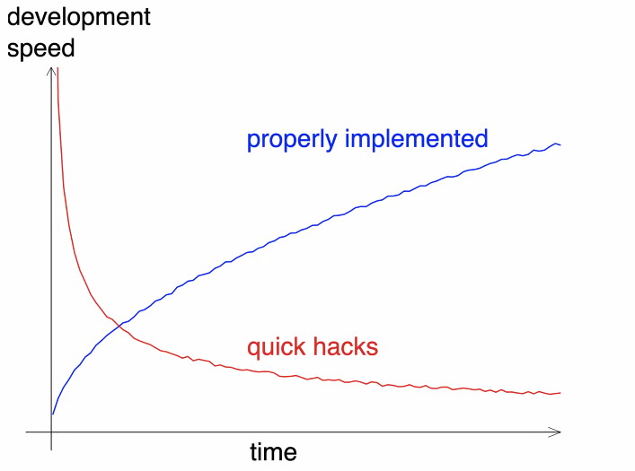

**Good module**
- clear interface
- clearly defined tasks
- has a good name (it must be clear what it does)
- readability
- it is pure (does not have a state)

Example (DNA code) ~readability
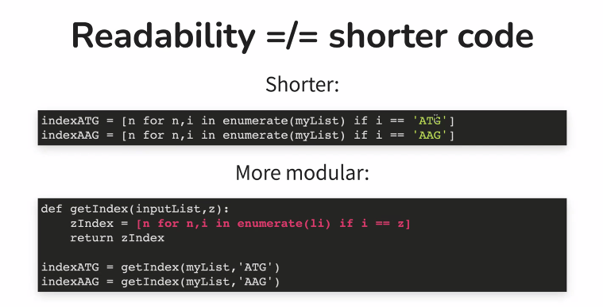

Here the code is converted to a function. Increases readability and less error sensitive

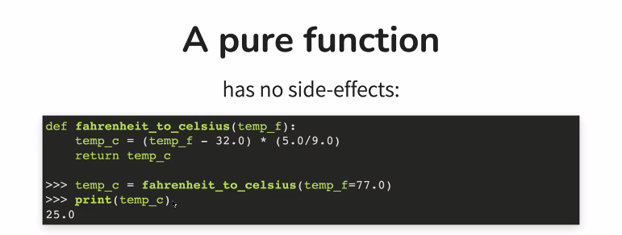

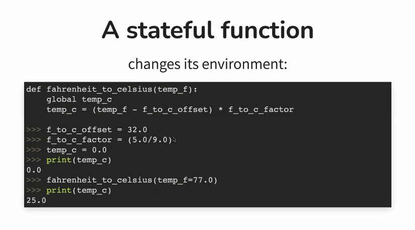

***Zen of Python***
```python
import this
```

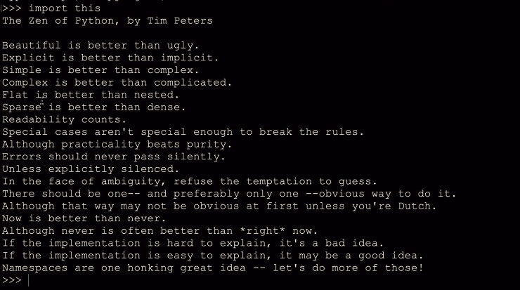

*Try to keep the components as clear as possible*
>*Having a config file with all variables* (Ole, 2023)

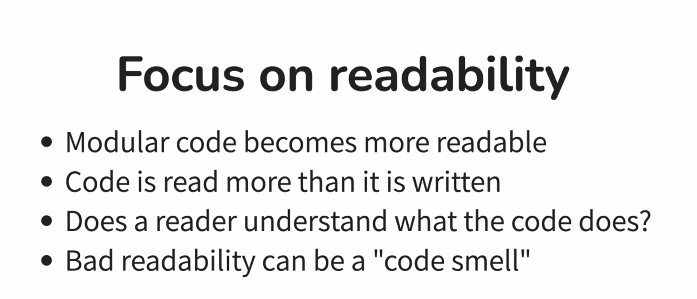

(be aware that most of the time the reader is your future self)

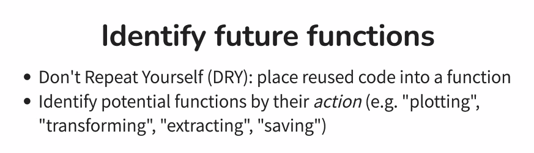

Think as your code as *verbs*. A verb identifies a function.

*Rule of thumb:*
When you have a lot of nested code --> modularize.

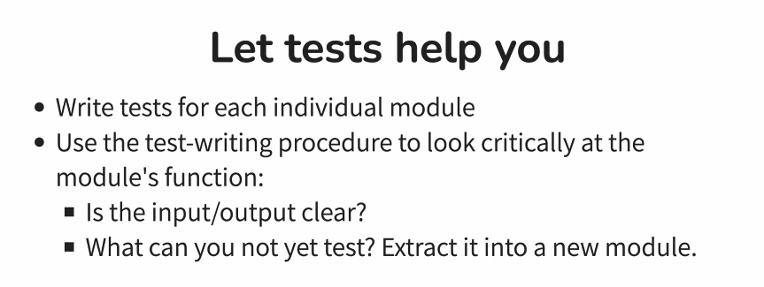

***Exercise 1***


***Documentation*** ~Luisa

Might be seen as a burden. It is going to pay off on the long term.


Episode 1: Why documenting code?
- To understand your own code.
- Find documentation in a central place.

***Exercise 2 :top***

What did we learn?

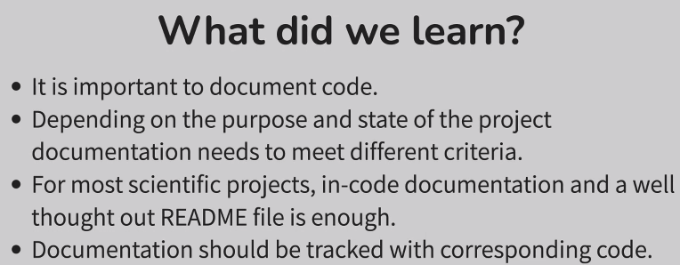

***Exercise 3***

- Avoid comments to keep zombie code :female_zombie:
- Avoid comments for replacing Git.


***Work on your own repository. ***

```bash
git checkout -b docs
```

```python
def mean_temperature(data):
    """
    Get the mean temperature.

    Args:
        data (pandas.DataFrame): A pandas databframe with air temperature measurements.
    Returns:
        The mean aire temperature (float)
    """
    temperatures = data['Air temperature (degC)']
    return sum(temperatures)/len(temperatures)
```

```bash
conda info --env
conda activate coderefinery
python
```


```python
from conversion import mean_temperature
help(mean_temperature)
```

- Different styles, rule of thumb; consistency

***Exercise 4***

What did we learn?

- Comments should describe the why for your code not the what.
- Docstings are an easy way to write documentation while you type your code.

***Episode 3:***

Readme


See Homework above

***Episode 4:***
Sphinx documentation

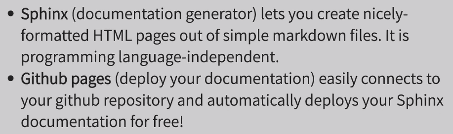

Code along!
Check if everything is installed correctly

```bash
python --version
sphinx-build --version
python -c "import sphinx_rtd_theme"
sphinx-quickstart --version
```

Continue when everything works.

add conversion.py

```bash
mkdir doc-example
cd doc-example
sphinx-quickstart
```

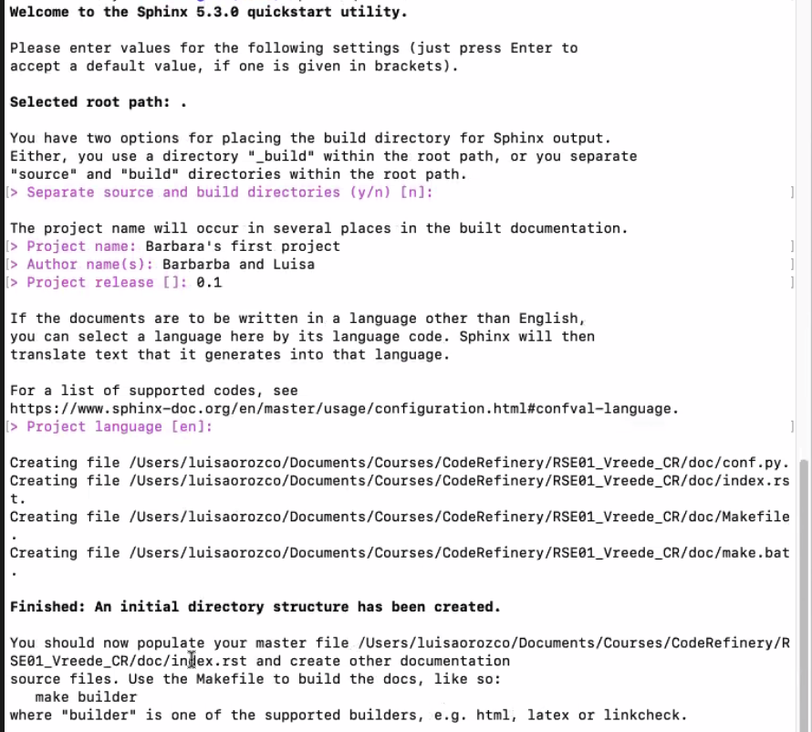

Questions appear to fill in.

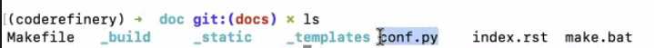

Standard files are created.

Let´s have a look at index.rst

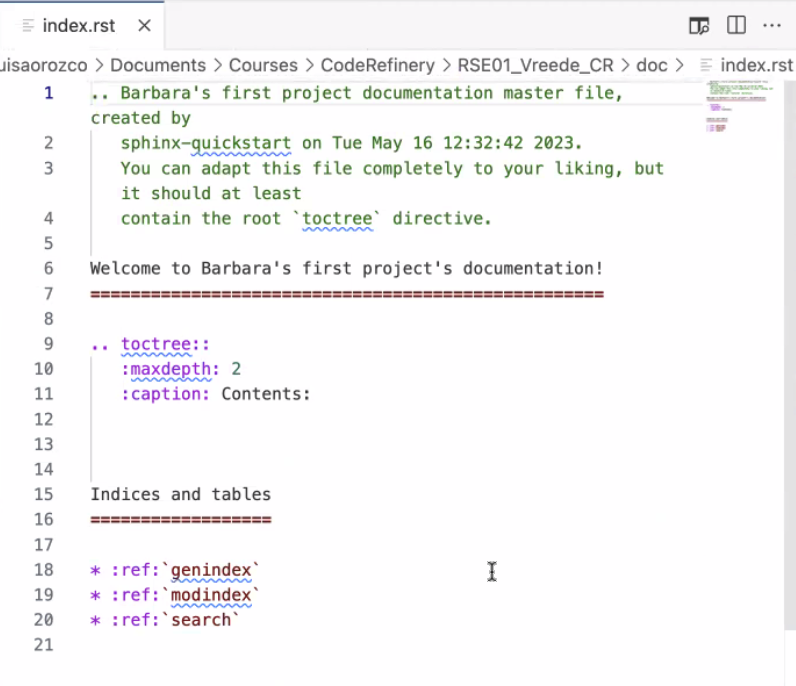

You will see a standardized file.

conf.py

Contains configuration

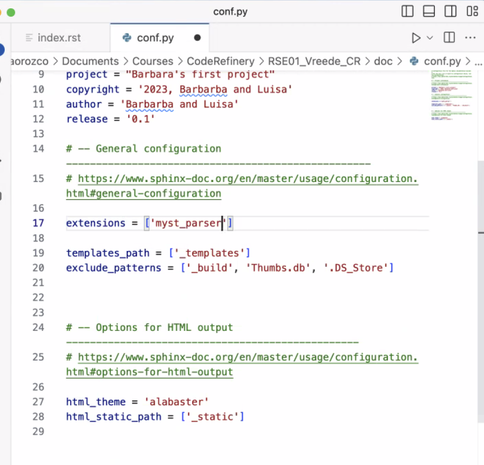

Replace the following:
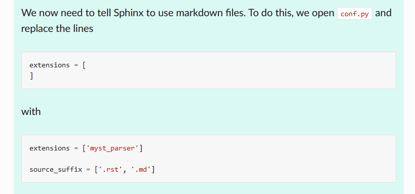

The first part tells Sphinx to use an extension to parse Markdown files and the second part tells it to actually look for those files.

Let’s create the file feature-a.md which we have just added to index.rst (note that one is .rst and one is .md):

```bash
# Some Feature A

## Subsection

I would like to have a list of my favo packages
- numpy
- pyvista
- machine learning
    - tensorflow
    - pytorch
    - keras

But I can also write this equation {math}`x=32 \beta` inline.

But I also can have equations:

```{math}
a^2 + b^2 = c^2
```


```bash
sphinx-build . _build
```

To check:

```bash
open _build/index.html
```

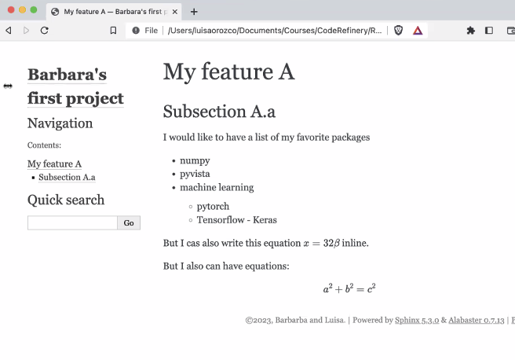

Should look something like this.

In conf.py you can change the theme (for instance `sphinx_rtd_theme`)

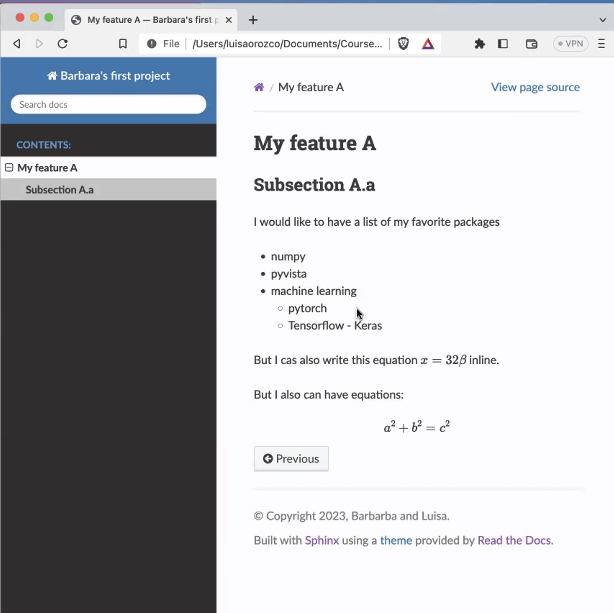


You can go to ´.gitignore´ to add doc/_build.

commit and push

go to repo in online viewer and have a look at the doc folder. You will see that once you added _build to .gitignore y


## 📚 Resources

**Link to the slides Modularity:**
https://nlesc-slides.github.io/2023-05-09-tusail/code_modularization/

**Link to the slides Documentation:**
https://nlesc-slides.github.io/2023-05-09-tusail/documentation/