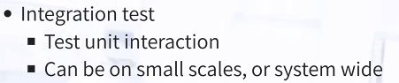

# Day 4 Collaborative Document

Welcome to the collaborative document for the 2023-05-09-ds-cr-tusail workshop.
This document is synchronized as you type, so that everyone viewing this document sees the same text.

## 🎓 Certificate of attendance

If you attend the full workshop you can request a certificate of attendance by emailing to training@esciencecenter.nl .

## ⚖️ License

All content is publicly available under the Creative Commons Attribution License: [creativecommons.org/licenses/by/4.0/](https://creativecommons.org/licenses/by/4.0/).

## 🙋Getting help

To ask a question, raise your hand in zoom. Click on the icon labeled "Reactions" in the toolbar on the bottom center of your screen,
then click the button 'Raise Hand ✋'. For urgent questions, just unmute and speak up!

You can also ask questions or type 'I need help' in the chat window and helpers will try to help you.
Please note it is not necessary to monitor the chat - the helpers will make sure that relevant questions are addressed in a plenary way.
(By the way, off-topic questions will still be answered in the chat).


## 🖥 Workshop website

💻 [Workshop website](https://esciencecenter-digital-skills.github.io/2023-05-09-ds-cr-tusail/)

🛠 [Setup instructions](https://esciencecenter-digital-skills.github.io/2023-05-09-ds-cr-tusail/#setup)

## 👩‍🏫👩‍💻🎓 Instructors

Barbara Vreede, Ole Mussmann, Luisa Orozco

## 🧑‍🙋 Helpers

Luisa Orozco, Maurice de Kleijn


## 🗓️ Agenda
|  Time | Topic                                  |     |
| -----:|:-------------------------------------- | --- |
|  9:00 | Welcome and icebreaker                 | :heavy_check_mark:    |
|  9:15 | Introduction to testing                |  :heavy_check_mark:    |
| 10:15 | Coffee break                           | :coffee:     |
| 10:30 | Introduction to Continuous Integration |  :heavy_check_mark:   |
| 11:30 | Coffee break                           |  :coffee:   |
| 11:45 | More advanced testing                  |:on:     |
| 12:45 | Wrap-up                                |     |
| 13:00 | END                                    |     |

## 🔧 Exercises

### Exercise 1: Test design
- Is the function pure?
- How would you test it?
- Is testing easy or hard? Why?

```python
#1
def factorial(n):
    """
    Computes the factorial of n.
    """
    if n < 0:
        raise ValueError('received negative input')
    result = 1
    for i in range(1, n + 1):
        result *= i
    return result
```

- It's a pure function
- Test it with a smaller than 0 number, and a regular number
- Testing is easy

```python
# 2
# Pure,
def count_word_occurrence_in_string(text, word):
    """
    Counts how often word appears in text.
    Example: if text is "one two one two three four"
             and word is "one", then this function returns 2
    """
    words = text.split()
    return words.count(word)

def test_count_word_occurrence_in_string():

    names = "Ben Ken Roy Ray Max Balazs Roxana Ken"

    num_john = count_word_occurrence_in_string(names,"John")
    assert num_john ==0, " John not there"

def test_count_word_occurrence_in_cat():
    names=[Rox, Ret, Max]

    with pytest.raises(Exception) as e_info:
        count_word_occurrence_in_string(names, "Rox")

    #with pytest.raises(Exception) as e_info:
    ##how to make sure it gives error whwn we have list instead of string

```

```python
# 3 (impure function)
def count_word_occurrence_in_file(file_name, word):
    """
    Counts how often word appears in file file_name.
    Example: if file contains "one two one two three four"
             and word is "one", then this function returns 2
    """
    count = 0
    with open(file_name, 'r') as f:
        for line in f:
            words = line.split()
            count += words.count(word)
    return count

```
- pure (impure)
- create a example file with some words with multiple occurances and read the file and count those occurances and comapre with expected results.
- time consuming sometimes (writing tests).


```python
# 4
def check_reactor_temperature(temperature_celsius):
    """
    Checks whether temperature is above max_temperature
    and returns a status.
    """
    from reactor import max_temperature
    if temperature_celsius > max_temperature:
        status = 1
    else:
        status = 0
    return status
```
- not pure: import of module
- testing strategy (easy): test if function works with max_temperature:

```python
def test_check_reactor_temperature():
    from reactor import max_temperature

    assert check_reactor_temperature(max_temperature) == 0
    assert check_reactor_temperature(max_temperature + 1) == 1
```

```python
# 5
class Pet:
    def __init__(self, name):
        self.name = name
        self.hunger = 0
    def go_for_a_walk(self):  # <-- how would you test this function?
        self.hunger += 1
    def eat(self):
        self.hunger -= 1

def test_pet():
    fluffy = Pet('fluffy')
    assert p.hunger == 0
    fluffy.go_for_a_walk()
    assert fluffy.hunger ==1

```

- issue is mutable, class has a state.


### Exercise 2 : Full-cycle collaborative workflow
This is an expanded version of the automated testing demonstration. The exercise is performed in a collaborative circle within the exercise group (breakout room).

The exercise takes 30-40 minutes.

In this exercise, everybody will:

A. Create a repository on GitHub/GitLab (everybody should use a different repository name for their repository)
B. Commit code to the repository and set up tests with GitHub Actions/ GitLab CI
C. Everybody will find a bug in their repository and open an issue in their repository
D. Then each one will clone the repo of one of their exercise partners, fix the bug, and open a pull request (GitHub)/ merge request (GitLab)
E. Everybody then merges their co-worker’s change


Overview of this exercise. Below we detail the steps.

#### Step 1: Create a new repository on GitHub/GitLab
Skip you already have a repo

#### Step 2: Clone your own repository, add code, commit, and push

Clone the repository.

Add a file `example.py` containing:

```python=
def add(a, b):
    return a + b


def test_add():
    assert add(2, 3) == 5
    assert add('space', 'ship') == 'spaceship'


def subtract(a, b):
    return a + b  # <--- fix this in step 8


# uncomment the following test in step 5
#def test_subtract():
#    assert subtract(2, 3) == -1

```
Test `example.py` with `pytest`.

Then stage the file (`git add <filename>`), commit (`git commit -m "some commit message"`),
and push the changes (`git push origin main`).


#### Step 3: Enable automated testing

In this step we will enable GitHub Actions.
- Select "Actions" from your GitHub repository page. You get to a page "Get started with GitHub Actions".
- Select the button for "Set up this workflow" under Python Application.


Select “Python application” as the starter workflow.

:bulb: If it doesn't appear automatically search for "Python application"


GitHub creates the following file for you in the subfolder `.github/workflows`:


```yaml
# This workflow will install Python dependencies, run tests and lint with a single version of Python
# For more information see: https://help.github.com/actions/language-and-framework-guides/using-python-with-github-actions

name: Python application

on:
  push:
    branches: [ main ]
  pull_request:
    branches: [ main ]

jobs:
  build:

    runs-on: ubuntu-latest

    steps:
    - uses: actions/checkout@v2
    - name: Set up Python 3.9
      uses: actions/setup-python@v2
      with:
        python-version: 3.9
    - name: Install dependencies
      run: |
        python -m pip install --upgrade pip
        pip install flake8 pytest
        if [ -f requirements.txt ]; then pip install -r requirements.txt; fi
    - name: Lint with flake8
      run: |
        # stop the build if there are Python syntax errors or undefined names
        flake8 . --count --select=E9,F63,F7,F82 --show-source --statistics
        # exit-zero treats all errors as warnings. The GitHub editor is 127 chars wide
        flake8 . --count --exit-zero --max-complexity=10 --max-line-length=127 --statistics
    - name: Test with pytest
      run: |
        pytest
   ```

Replace `pytest` by `pytest example.py`:
```yaml
   - name: Test with pytest
     run: |
       pytest example.py
```


Commit the change by pressing the "Start Commit" button.

#### Step 4: Verify that tests have been automatically run

Observe in the repository how the test succeeds. While the test is executing, the repository has a yellow marker.
This is replaced with a green check mark, once the test succeeds.


Green check means passed.

Also browse the "Actions" tab and look at the steps there and their output.

#### Step 5: Add a test which reveals a problem

After you committed the workflow file, your GitHub/GitLab repository will be ahead of your local cloned repository. Update your local cloned repository:

```
$ git pull origin main
```
or
```
$ git pull origin master
```
Next uncomment the code in `example.py` under “step 5”, commit, and push. Verify that the test suite now fails on the “Actions” tab (GitHub) or the “CI/CD->Pipelines” tab (GitLab).


#### Step 6: Open and issue on GitHub/GitLab
Open a new issue in your repository about the broken test (click the “Issues” button on GitHub or GitLab and write a title for the issue). The plan is that your colleague will fix the issue through a pull/merge request

#### Step 7: Fork and clone the repository of your colleague

Fork the repository using the GitHub/GitLab web interface.

Make sure you clone the fork after you have forked it. Do not clone your colleague’s repository directly.

```shell=
git clone https://gitlab.com/your-username/the-repository.git
```

#### Step 8: Fix the broken test

After you have fixed the code, commit the following commit message `"restore function subtract; fixes #1"` (assuming that you try to fix issue number 1).

Then push to your fork.

#### Step 9: Open a pull request (GitHub)/ merge request (GitLab)

Then before accepting the pull request/ merge request from your colleague, observe how GitHub Actions/ Gitlab CI automatically tested the code.

If you forgot to reference the issue number in the commit message, you can still add it to the pull request/ merge request: `my pull/merge request title, closes #NUMBEROFTHEISSUE`

#### Step 10

Observe how accepting the pull request/ merge request automatically closes the issue (provided the commit message or the pull request/ merge request contained the correct issue number).

Discuss whether this is a useful feature. And if it is, why do you think is it useful?


## 🧠 Collaborative Notes


**Documentation** ~Luisa

Today we are automatically going to create our documentation.

Folder structure:
```
.
├── conversion.py
├── doc
│   ├── api.rst
│   ├── _build
│   ├── conf.py
│   ├── feature-a.md
│   ├── index.rst
│   ├── make.bat
│   ├── Makefile
│   ├── _static
│   └── _templates
└── README.md
```

In terminal
```bash
code api.rst
```

```
Python API
==========

Conversion
++++++++++

.. automodule:: conversion
   :members:
```

In conf.py add:
```
import os
import sys

sys.path.insert(0, os.path.abspath("../"))

# in extensions add "sphinx.ext.autodoc"
extensions = ['myst_parser', "sphinx.ext.autodoc"]

    In index.rst add API below feature-a.md
```

In terminal
```
sphinx-build . _build
```


Module is added.

In index.rst add api.rst


Hava a look here https://github.com/TUSAIL/RSE01_Vreede_CR/tree/docs to see the updated files.


Deployment of the repo.

Create 2 new folders with a the documentation file.

```bash
code .github/workflows/documentation.yaml
```

Paste the following code in the file .yaml file
```
name: Docs
on: [push, pull_request, workflow_dispatch]
permissions:
    contents: write
jobs:
  docs:
    runs-on: ubuntu-latest
    steps:
      - uses: actions/checkout@v3
      - uses: actions/setup-python@v3
      - name: Install dependencies
        run: |
          pip install sphinx sphinx_rtd_theme myst_parser
      - name: Sphinx build
        run: |
          sphinx-build doc _build
      - name: Deploy
        uses: peaceiris/actions-gh-pages@v3
        if: ${{ github.event_name == 'push' && github.ref == 'refs/heads/main' }}
        with:
          publish_branch: gh-pages
          github_token: ${{ secrets.GITHUB_TOKEN }}
          publish_dir: _build/
          force_orphan: true

```

new folder structure:
```
.
├── _build
│   ├── doctrees
│   └── html
├── conversion.py
├── doc
│   ├── api.rst
│   ├── _build
│   ├── conf.py
│   ├── feature-a.md
│   ├── index.rst
│   ├── make.bat
│   ├── Makefile
│   ├── _static
│   └── _templates
├── .git
├── .github
│   └── workflows
│         └── documentation.yaml
├── .gitignore
└── README.md

```

Optionally, check if all the links are valid:

```bash
sphinx-build doc -W -b linkcheck -d _build/doctrees _build/html
```

Go to the github webapp


Actions >
You will see:


two times green check circles

Merge to main:


Confirm the merge


Merge pull request will trigger the action to create the gh-pages.


Next, settings, pages


Select:


click on **Save**

This has triggered another action:


# Testing!! ~Ole
Why do we test?


Why not test?

- trivial
- can become very laborious


One shot code; probably no tests needed.

**Test types**




Analyse Test Coverage:
[Codecov.io](https://about.codecov.io/)

*Terminal*

```
bash mkdir pytest-example
cd pytest-example
code example.py
python3

````

```python=
# in example.py
def add(a,b):
    return a + b

def test_add(): # Special name!
    assert add(2, 3) == 5 # What is assert?
    assert add('space', 'ship') == 'spaceship'

def subtract(a, b):
    return a + b
```

In case pytest is not installed yet run
```bash
pip install -u pytest
```

Run the tests:
```bash
pytest example.py
```


Recap : Purity


**Test Design**

Test for weird things ~Impure functions

example:


When working with files (e.g. temp file)


External imports


***[Exercise 1](https://codimd.carpentries.org/EFvtBKfHQ2urv9MdE0ZlSQ?both#Exercise-1-Test-design) :top:***

**Some advice:**

- *When testing, create a test that fails*

Take-away after exercise 1:


#### Testing ALL THE THINGS:


### Continuous Integration
What does it mean?


Wrap-up final discussion:

What improvements could your project benefit from?
> Need for GPU sources - Ole Advices Cloud solutions


In case you contribute to a FOSS repo.
- First make an issue, next fork and pull request.


## 📚 Resources
- [:movie_camera: Video about comments](https://www.youtube.com/watch?v=Bf7vDBBOBUA)
- [Testing Randomness](https://coderefinery.github.io/testing/test-design/#testing-randomness)
- [Testing Slides](https://nlesc-slides.github.io/2023-05-09-tusail/testing)
- [Continuous Integration Slides](https://nlesc-slides.github.io/2023-05-09-tusail/ci)
- [Reserved key words for closing issues](https://docs.github.com/en/issues/tracking-your-work-with-issues/linking-a-pull-request-to-an-issue#linking-a-pull-request-to-an-issue-using-a-keyword)
